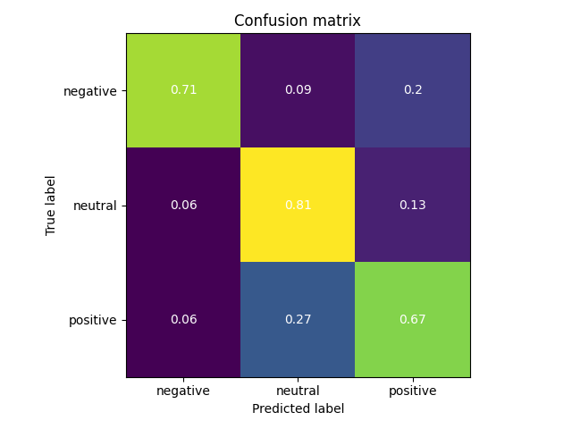

# Sentiment Analysis on headlines of financial news articles

## Introduction
The goal of this project was to introduce SVM and Kernel methods, which is visible on the `report.pdf`. This readme is about the application part.

The application has two parts:
1. Converting the headlines to vectors
2. Classifying the vectors as positive, negative or neutra

## Converting the headlines to vectors
This was done using a pretrained Word2Vec model with Gensim and NLTK libraries. The model was trained on the Google News dataset, which contains 3 million words and phrases and was trained on roughly 100 billion words from a Google News dataset. The model contains 300-dimensional vectors for 3 million words and phrases. The model can be downloaded from [here](https://huggingface.co/fse/word2vec-google-news-300).


## Classifying the vectors as positive, negative or neutral
The data for classification was taken from [Kaggle](https://www.kaggle.com/ankurzing/sentiment-analysis-for-financial-news). The data contains 4846 headlines from financial news articles, which have been labeled as positive, negative or neutral ([more info from authors](https://asistdl.onlinelibrary.wiley.com/doi/full/10.1002/asi.23062?casa_token=udn2xhCMl5oAAAAA%3ALObFzgah6OWLNc8RkNSLG9eBhK2xImHc39_mk-FB2GVggFpVYiQwxTD-XOdx64PvLlPdHMyJ8c6l-YAG)).

The classification was done using SVM (sklearn SVC implementation). To find good parameters for SVM, and class weights/SMOTE for imbalanced data, a grid search was done. The grid search was done using 5-fold cross validation. The best parameters were selected based on the best macro F1 score.

The model achieved a macro-F1 score of 0.72 on the test set, with a accuracy of 76%.

We also tried the model on some made-up headlines:
```
US banks prepare for losses in rush for commercial property exit.: negative
Oil prices pop after Saudi Arabia pledges more voluntary production cuts.: negative
Nvidia short-sellers bleed $3.6bn in May as AI boom continues.: negative
Silicon Valley's tech giants are in trouble. Here's why.: negative
Now is a good time to buy stocks, history shows.: neutral
Federal Reserve's Jerome Powell says economic recovery could stretch through end of 2023.: neutral
Putin moves to extend his rule until 2036 after Russians vote to back constitutional changes.: neutral
U.S. stock futures show S&P 500 consolidating at 2023 highs after Friday's powerful session.: positive
Amazon beats expectations with $88.9bn in sales, stock surges.: positive
Google issues positive earnings surprise as ad revenue rebounds.: positive
```




*Confusion matrix of the best model on test data*
